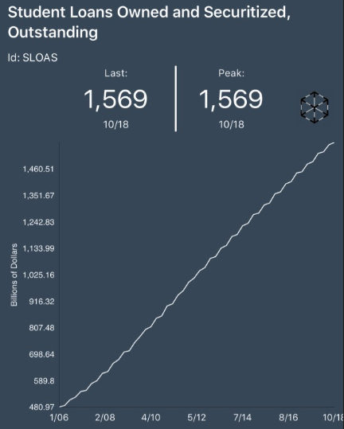
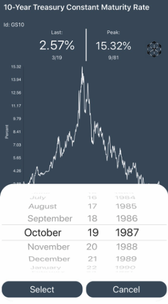

# FedCharts
I had a ton of fun building FedCharts. 

FedCharts is a simple app that uses the St. Louis Federal Reserve's robust FRED API to display, save, and update economic charts.

## Why build FedCharts?
My inspiration behind FedCharts started with a curiousity to explore using FRED's open API, and explore building and shipping an app that _I_ would like to use.

In my former life as a real estate investment management professional, I often hopped between different economic data sources. Especially relevant to me was the 10 Year U.S. Treasury Constant Maturity Rate. This rate is the key long-term interest rate used throughout finance as a "benchmark rate", or the "rate to rule them all". This data is available from a wide number of sources, but since it is so popular, finding this information on a website usually involves clicking through ad after ad after ad, just to see the one number, say 2.56%. I wanted to build FedCharts as a simple app for those looking for all the key metrics in one place.

I also built FedCharts because I find reviewing some of the old economic charts quite fascinating. For instance: Did you know the U.S. tracked Cold-Storage Beef Holdings for >40 yrs? (1915-1955) I didn't either! And did you know that there are now greater than $1.5 Trillion in owned and securitized student loans? The chart looks like this:

That's an astonishing amount of student debt! As an aside: I truely believe that Lambda School can help drive our society's reliance on student debt down by creating newer, more effective forms of education finance.

## More ScreenShots

