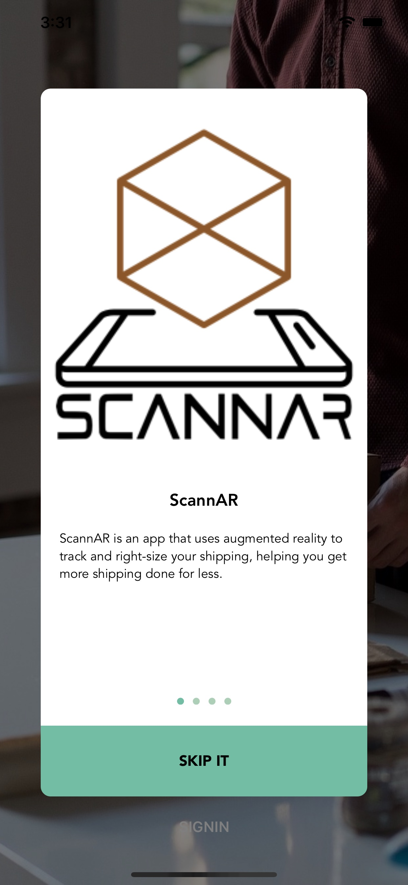
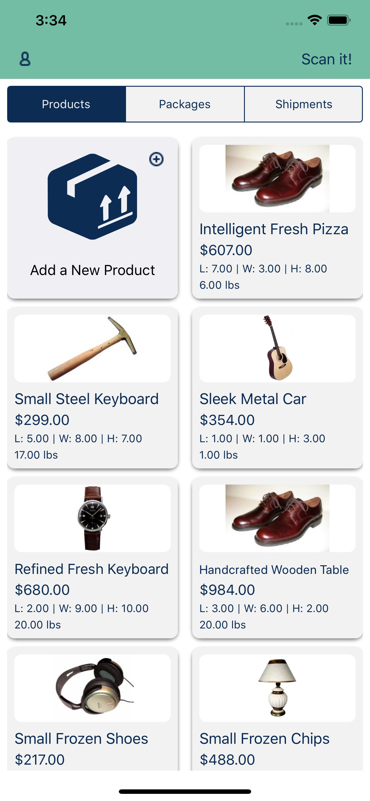
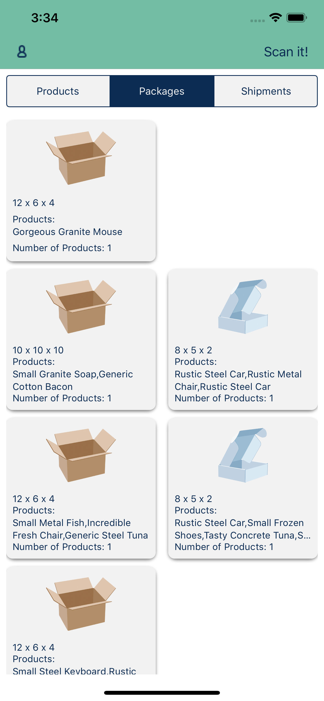
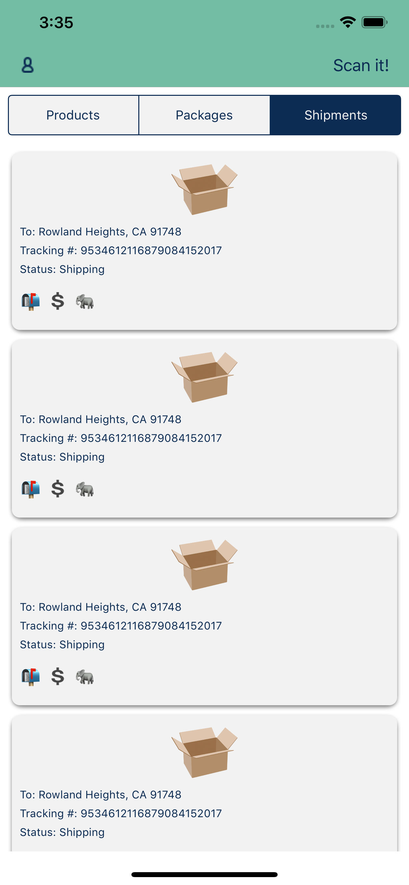
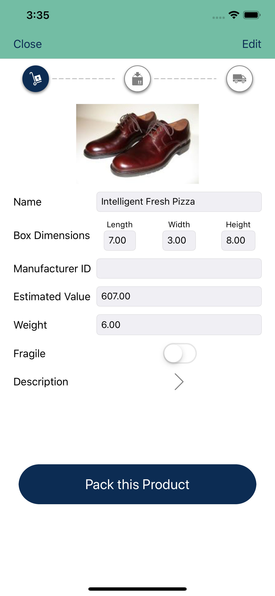
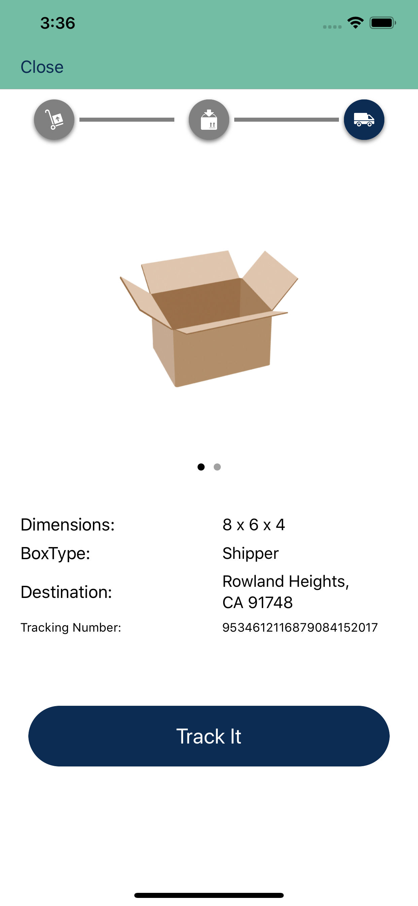
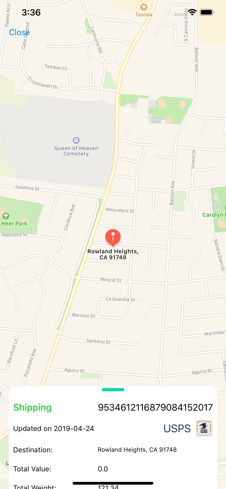
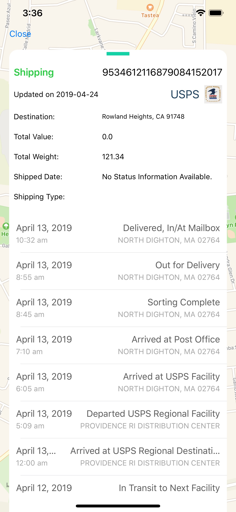

Over the last couple years, I've been fascinated with ARKit, Apple's on-device framework for creating "augmented" real world experiences. Augmented reality is so cool - it basically allows you to overlay digital information over an already rendered real world. There are so many cool applcations: from [this](https://twitter.com/AndrewProjDent/status/1116401793993408512) example of indoor navigating with AR, to Ikea's [Place](https://9to5mac.com/2017/09/19/ikea-place-augmented-reality-app-download/) app which helps you select furniture with AR, to [countless](https://github.com/olucurious/Awesome-ARKit) other cool projects.

So, when I heard that there was an opportunity to work on an AR-enabled app for my 5-week Lambda School Labs project, I jumped at the chance.

## Lambda Labs

Lambda Labs is a unique, 5-week program that happens 15-weeks into the Lambda School curriculum. For 5 weeks, teams of web and mobile developers work together to build and ship apps. My team for labs was composed of 2 iOS developers (including myself), and 3 web developers (front end and back end). During the five weeks we worked to:
- Build a back-end server to handle all front end client requests (both iOS and Web)
- Build a complete front-ened web app
- Build a complete iOS app with the ability to scan a product baked into the product

We had our work cut out for us for the product, but luckily I was fortunate to work with some really talented developers including [Joshua Kaunert](https://www.linkedin.com/in/jkaunert/)(iOS), [Jacob Bryan](https://www.linkedin.com/in/jbryanlink/)(Web), [Randy Wilson](https://www.linkedin.com/in/randy-wilson-dev/)(Web), and [Ian Cameron](https://www.linkedin.com/in/ianpcameron/)(Web).

## App Premise

The idea with ScannAR was to help e-commerce sellers size and measure the products they wanted to ship. Working with our co-op partner, ARKA.com, ScannAR recommends packages based on the user's scan of the product they want to ship. ScannAR then recommends the user an (ARKA) box based on that scan. The user could then order that custom packaging, and after backing the product in the packaging, ship it and track the package to its destination. Users can  also catalog the products they ship and the packaging sizes users routinely use, as well as track product from pickup to delivery.

## Contribution Highlights


Some of my specific contributions to this project included:
- Building a suite of custom, generic RESTful API requests to the team's backend server including this generic request that all 19 different api request used.
```swift
 private func apiRequest<T: Codable>(from urlRequest: URLRequest,
                                        using session: URLSession = URLSession.shared,
                                        completion: @escaping (T?, Error?) -> Void) {
        session.dataTask(with: urlRequest) { (data, response, error) in
            if let error = error {
                completion(nil, error)
                return
            }
            
            guard let data = data else {
                completion(nil, NSError(domain: "com.lambdaSchool.ErrorDomain", code: -1, userInfo: nil))
                return
            }
            
            do {
                let jsonDecoder = JSONDecoder()
                let decodedObject = try jsonDecoder.decode(T.self, from: data)
                completion(decodedObject, nil)
            } catch {
                print("Error:\(error)")
                completion(nil, error)
            }
            }.resume()
    }
```
- Implementing image caching and custom animations to create a fast, seamless user experience.
- Collaborating with the backend team on the database schema and API endpoint architecture.
- Designed collection view/app modal userflow including custom animations (see .gif above).
- Implementing OAuth through Google’s Firebase iOS SDK.


## On the AppStore

ScannAR will be made available on the TestFlights, then the app store in early May 2019. If you'd like to test it out, or have are feedback for our project, please reach out to me a ben@hakes.dev.

## More Gifs & ScreenShots

<div align="center"></div>
<div align="center"></div>
<div align="center"></div>
<div align="center"></div>
<div align="center"></div>
<div align="center"></div>
<div align="center"></div>
<div align="center"></div>
<div align="center"></div>
