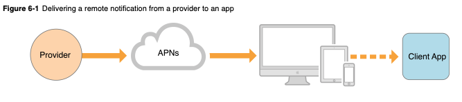

This post represents a summary of an Apple Article on APNs (Apple Push Notification service). For every greater detail about this topic, check out the [full article](https://developer.apple.com/library/archive/documentation/NetworkingInternet/Conceptual/RemoteNotificationsPG/APNSOverview.html#//apple_ref/doc/uid/TP40008194-CH8-SW1).

### Apple Push Notification service (APNs)

[APNs](https://developer.apple.com/library/archive/documentation/NetworkingInternet/Conceptual/RemoteNotificationsPG/APNSOverview.html#//apple_ref/doc/uid/TP40008194-CH8-SW1) are the centerpiece of Apple's remote notification feature.

Remote notifications are a secure way for the developer to propogate information to iOS (and indirectly onto watchOS), macOS, tvOS.

### APNs to the App

When the app is first set up, this system automatically creates a secure, persistent IP connection between the app and Apple Push Notification services (secure Apple cloud servers).

### Provider Server to APNs

If you want to send a notification, you would usually do so from a server that you manage or control. This is often referred to in the Apple Documentation as a _provider_ server. This server is configured to work with APNs, and requires a developer account and special cryptographic keys from Apple.

### Sending a notification

When the APN setup is complete, the provider server must initial a push notification to the APNs. The APNs will then pass that notification onto the device. Depending on the state the device/app is in, the notification will either be presented to the user, will be held to be presented to the user later, or will be attempted again.

### The provider server's job

- _Receiving_ globally unique app-specific device tokens (and other data).
- _Determining_ when remote notifications need to be sent to each device.
- _Sending_ the notification with the appropriate information and payload.

### What does the provider do to send a notification?

- Construct a JSON dictionary with the notification payload.
- Send payload and a unique device token in an HTTP/2 request.
- Send with a cryptographically signed credential via a token or certificate on a secure channel.
