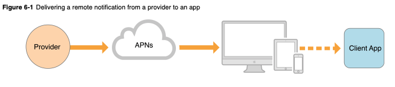

Functions are a foundational mathematical concept that can be very useful tool when developing and reasoning about software programs.

Before we dive if further I want to attempt to introduce a definition of the term `Function`. Let's start with a definition.

### Defining a Function
Here's the definition of a Function from my math [textbook](https://www.amazon.com/s?k=9780070681880&gclid=CjwKCAjwiN_mBRBBEiwA9N-e_phRz6Mbr5e8pzbsp8CD3TDc8EhSrNn33RfgJyq9orlYwoSvcVH1CxoCfpAQAvD_BwE&hvadid=241635139357&hvdev=c&hvlocphy=9060341&hvnetw=g&hvpos=1t1&hvqmt=e&hvrand=17933693156552449310&hvtargid=kwd-389024086782&hydadcr=3172_10390836&tag=googhydr-20&ref=pd_sl_2w5nv516qx_e).
> > "Let _A_ and _B_ be nonempty sets. A _function f_ from _A_ to _B_ is an assignment of exactly one element of _B_ to each element of _A. We write _f(a) = b_ if _b_ is the unique element of _B_ assigned by the function _f_ to the element _a_ of _A_. If _f_ is a function from _A_ to _B_, we write _f: A -> B_.

Okay. Admittedly, this sounds like a lot of gobledy-gook. Set, functions, unique assignment? Huh? Not to be outdone, my math textbook also provides a  

### Apple Push Notification service (APNs)

[APNs](https://developer.apple.com/library/archive/documentation/NetworkingInternet/Conceptual/RemoteNotificationsPG/APNSOverview.html#//apple_ref/doc/uid/TP40008194-CH8-SW1) are the centerpiece of Apple's remote notification feature.

Remote notifications are a secure way for the developer to propogate information to iOS (and indirectly onto watchOS), macOS, tvOS.

### APNs to the App

When the app is first set up, this system automatically creates a secure, persistent IP connection between the app and Apple Push Notification services (secure Apple cloud servers).

### Provider Server to APNs

If you want to send a notification, you would usually do so from a server that you manage or control. This is often referred to in the Apple Documentation as a _provider_ server. This server is configured to work with APNs, and requires a developer account and special cryptographic keys from Apple.

### Sending a notification

When the APN setup is complete, the provider server must initial a push notification to the APNs. The APNs will then pass that notification onto the device. Depending on the state the device/app is in, the notification will either be presented to the user, will be held to be presented to the user later, or will be attempted again.

### The provider server's job

- _Receiving_ globally unique app-specific device tokens (and other data).
- _Determining_ when remote notifications need to be sent to each device.
- _Sending_ the notification with the appropriate information and payload.

### What does the provider do to send a notification?

- Construct a JSON dictionary with the notification payload.
- Send payload and a unique device token in an HTTP/2 request.
- Send with a cryptographically signed credential via a token or certificate on a secure channel.